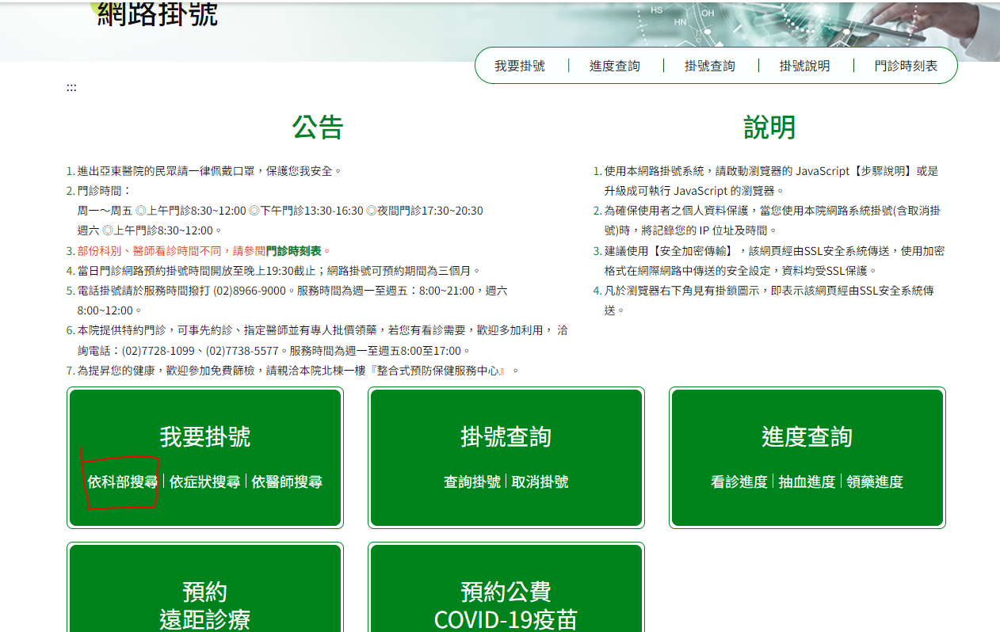
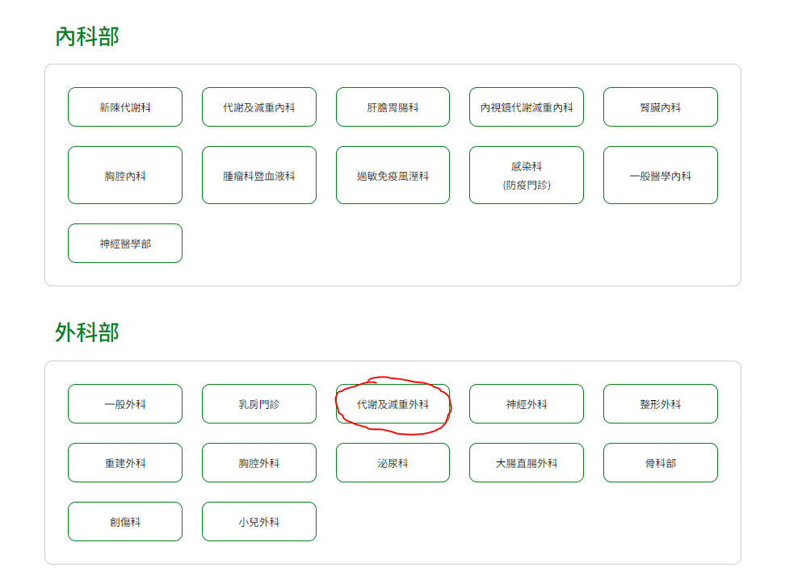

# 第1次作業-作業-HW1
>
>學號：111111132
> 
>姓名：林韋佑
> 
>作業撰寫時間：124 (mins，包含程式撰寫時間)
> 
>最後撰寫文件日期：2024/04/21
>

本份文件包含以下主題：(至少需下面兩項，若是有多者可以自行新增)
- [x] 說明內容
- [x] 個人認為完成作業須具備觀念

## 說明程式與內容
建立A.txt檔案 -> 寫上作業題目This is an apple. -> 按照步驟 add完commit到倉庫push到伺服器 -> 再打開A.TXT的This is an apple後面打上五列This is a bear. -> 執行同樣步驟 add完commit到倉庫push到伺服器 -> 建立dev分支並切換 -> 在分支把A.txt的This is a bear.刪除並留下一列This is an apple. -> 回到main -> 合併分支 按照步驟 add完commit到倉庫push到伺服器
# 1.開啟網站並選擇科別
 
# 2.選擇科別線上掛號
 
# 3.選擇日期 醫生 點選我要掛號

# 4.填寫初診資料

# 5.填寫基本資料

# 6.填寫個人健康資料 按下確認掛號

# 7.掛號成功

# 8.取消掛號

# 9.取消掛號成功

## 個人認為完成作業須具備觀念
上學期沒有選這課程 第一次做課程功課雖然有點困難 但步驟都很清晰 能夠一步一步造著步驟做 多練習的話可以得心應手
